# Battleship Project

## Introduction

Today we're going to build a game of battleship in your CLI (Command Line Interface)

## Setup

To start out on this project first fork & clone this repository into a local folder.

In your local folder run:

```bash
bun install
```

## About the Game

### The Board

Battleship is a game where you start with a blank board that looks like this:

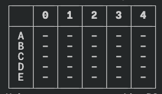

Each `-` that you see represents a spot that you don't know what it is, but when you make a guess it reveals what is underneath. For example a board might look like this underneath all of the blank spaces.

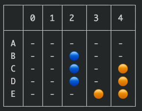

The goal is that as you make your guesses:, the board will reveal what is underneath each spot, and tell if you hit a ship or not. If you've never played battleship before, here is a video walkthrough of the game that you are going to be building.

<https://www.loom.com/share/b130651fb21749b1814e475a3ffb1e34?sid=5e96e14c-fb25-4c4b-995c-3802c968d2a4>

### The Ships

Hidden in the board will be two types of ships, "small" | "large". The only difference between these ships is:

- What we show the user when they hit it
- how long the ship is

#### Small Ship

A Small ship will take up 2 spaces on the board, and to let someone know what type of ship they hit, this ship will show up as an orange circle (You can use emojis in order to capture this)

So on your board, if you guess all the spots for a small ship it would look like this

```
🟠 | 🟠
```

or this

```
🟠
--
🟠
```

#### Large Ship

A Large ship will take up 3 spaces on the board, and to let someone know what type of ship they hit, this ship will show up as an Blue circle (You can use emojis in order to capture this)

So on your board, if you guess all the spots for a blue ship it would look like this

```
🔵 | 🔵 | 🔵
```

or this

```
🔵
--
🔵
--
🔵
```

## Part 1: Build a Renderer

In the first part of this project, we've decided to help you out a bit and guide you towards rendering a specific state of your board. We're not building this function for you, but it should help dramatically by:

- Giving you a target data structure to create and work with
- By focusing on rendering first, we can test out our code much easier moving forward
- Giving you a declarative model (given state A, the board should look like B)

For example, take the following state for a board.

```js
const board = [
  [
    { type: "large", id: 1, hit: false }, // Represents position A0
    { type: "small", hit: false }, // Represents position A1
    { type: "small", hit: false }, // Represents position A2
  ],
  [
    { type: "large", id: 1, hit: false }, // Represents position B0
    { type: "empty", hit: false }, // Represents position B1
    { type: "empty", hit: false }, // Represents position B2
  ],
  [
    { type: "large", id: 1, hit: false }, // Represents position C0
    { type: "empty", hit: false }, // Represents position C1
    { type: "empty", hit: false }, // Represents position C2
  ],
];
```

We can see that since the first element of the array represents the first row and all elements have a `hit` key set to false, every element of the first row will be:

`- | - | -`

In fact the second and third element of the array ALSO have `hit` keys set to false, therefore they should all render the same, and your table should just look like this:

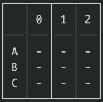

Right now this means that although we are rendering `-` to the user, we actually do have a large ship located at A0, B0, C0. Although we're not rendering it to the user, underneath the board we have this location for our ships:

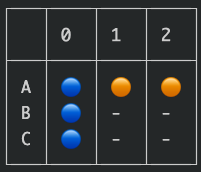

As the game progresses, if we guess correctly we will reveal what is underneath the position. If there is a ship, show the piece of that ship, but if there is none, show an X.

For example if a user guesses A1 as their very first guess, I can modify the board to be this data structure instead:

```js
const board = [
  [
    { type: "large", id: 1, hit: false }, // A0
    // Changed hit to true
    { type: "small", hit: true }, // A1 👈 Here we can see I changed "hit" to true
    { type: "small", hit: false }, // A2
  ],
  [
    { type: "large", id: 1, hit: false }, // B0
    { type: "empty", hit: false }, // B1
    { type: "empty", hit: false }, // B2
  ],
  [
    { type: "large", id: 1, hit: false }, // C0
    { type: "empty", hit: false }, // C1
    { type: "empty", hit: false }, // C2
  ],
];
```

And my `printBoard` function will take in that shape and render this:

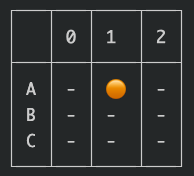

And if my user then guesses B1, the board will print like this:


This brings us to our first real task!

## Task 1: Build a `printBoard` function

For your first task, build a function called `printBoard` that takes in two arguments:

#### Argument 1: The Board

The board is that data structure that we showed you above. It's an array of objects that represent the ships in the positions they belong.

#### Argument 2: a `debug` flag

The purpose of this `debug` flag is to help us, the developers understand if we're printing our board correctly, and later help us determine if we:

- placed our ships correctly
- are changing the board correctly

All that it does is, if `debug` is true, then we should reveal ALL THE SHIPS, regardless of if they have been hit or not. But if the debug flag is false, we ONLY reveal positions that have been "hit".

For example let's look at this data structure from before

```ts
const board = [
  [
    { type: "large", id: 1, hit: false }, // A0
    { type: "small", id: 2, hit: true }, // A1
    { type: "small", id: 2, hit: false }, // A2
  ],
  [
    { type: "large", id: 1, hit: false }, // B0
    { type: "empty", hit: false }, // B1
    { type: "empty", hit: true }, // B2
  ],
  [
    { type: "large", id: 1, hit: false }, // C0
    { type: "empty", hit: false }, // C1
    { type: "empty", hit: false }, // C2
  ],
];
```

If we call `printBoard(board, false)`, then we should see this:


_Note: We can get node / bun to log a table like this by using the console.table method like so..._

```js
console.table({
  A: ["-", "🟠", "-"],
  B: ["-", "-", "❗"],
  C: ["-", "-", "-"],
}); // go ahead and try copying and pasting this into a script and testing it out for yourself <3
```

But if we call `printBoard(board, true)`, then we should see this:

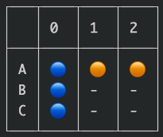

Now as developers, we can get a much better gauge of what is going on later when we get to the harder parts of building this (which will be all you). I strongly strongly strongly recommend that you do a good job at this part before moving forward, if you don't then debugging will be very hard.

One way of checking your work is, create a file called messaround.js (or ts if you like), and just manually check that the board is printing correct for different states, if you're feeling really extra you can even ask an instructor how to set up proper testing for something like this:

```js
// messaround.js
import { printBoard } from "./some-other-file";

const testBoard1 = [
  [
    { type: "large", id: 1, hit: false }, // Represents position A0
    { type: "small", id: 2, hit: true }, // Represents position A1
    { type: "small", id: 2, hit: false }, // Represents position A2
  ],
  [
    { type: "large", id: 1, hit: false }, // Represents position B0
    { type: "empty", hit: false }, // Represents position B1
    { type: "empty", hit: true }, // Represents position B2
  ],
  [
    { type: "large", id: 1, hit: false }, // Represents position C0
    { type: "empty", hit: false }, // Represents position C1
    { type: "empty", hit: false }, // Represents position C2
  ],
];

console.log("Test Board 1 is...");
printBoard(testBoard1, false);
console.log("Test Board 1 should be...");
console.table({
  A: ["-", "🟠", "-"],
  B: ["-", "-", "❗"],
  C: ["-", "-", "-"],
});
```

Now you get an output that you can quickly parse through and determine if you were wrong... much nicer than manually running 20 different ways :)

_Note: Automated testing is a way of automating this exact thing, so that way all you have to do is run a button and make sure all your different boards are correct. Don't want to put too much on you at once, but if you're interested it's definitely worth looking into :)_

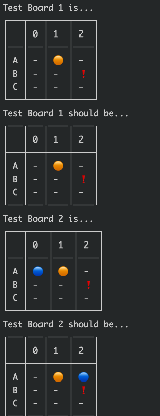

## Part 2: Specifications

One of the really important goals of larger projects like this is we don't want to spoon feed you every tool you need to get the job done. Just like as a woodworker, it's not enough to know HOW to use a saw or drill, you also have to know WHEN to use a saw or drill, and sometimes you have to modify the table to get your own cuts.

The only way that we develop our intuition around picking our tools, and knowing when to build custom things, is by being thrown into the abyss of the unknown and having to figure things out from there. It's not an easy journey, but it's an essential one.

Remember, anytime in a readme that you see the following, it's actually a checkbox:

```md
- [ ] Something %%unchecked%%
- [x] Some other thing %%checked%%
```

To prove this in VSCode type in `CMD + Shift + P` to open up your command menu. Then look for `Markdown: Open Preview` command, you'll see it shows you how a proper markdown renderer (like the one built into github readmes for example) would render your markdown.

When you first run your terminal game you should be greeted with the following text:

### Greeting Menu

```txt
Welcome to Battleship 🚢
choose a Board Size
```

- [ ] On this menu you should be able to either select a size, or type in 4, 5 or 6 in order to make the board a

- [ ] 4X4 like this:
      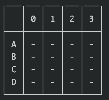

- [ ] 5X5 like this:

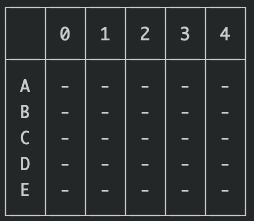

- [ ] 6X6 like this:

  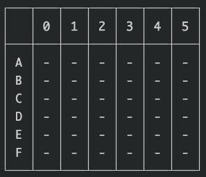

### Ship Placement

- [ ] Ships should be randomly placed
- [ ] Ships cannot overlap each other
  - _note: your `debug` flag should help with getting this part correct_
- [ ] Ships must be placed within the bounds of the board

### Rendering

- [ ] The board must always print according to the [The Details found in the board section](#the-board)

### Game Flow

- [ ] Each Turn we should see this screen:
  - [ ] The board is printed
  - [ ] Underneath we can see `Make a guess eg.. A1, B2, etc...`
        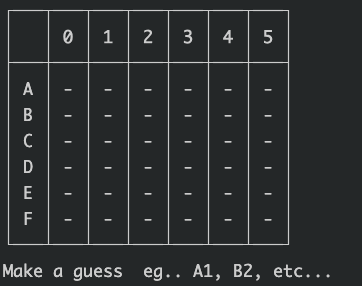
- [ ] In between guesses, you should clear the console so that way you are only looking at the fresh information and not the information from the previous turn. This can be accomplished with...

```js
console.clear();
```

- [ ] If the user types in an Invalid input, the game should say "Sorry but that is not a valid input", or something along those lines. But most importantly, IT SHOULD NOT CRASH and if it does then on this assignment...

  

- [ ] When the user guesses, you're board must be updated correctly
- [ ] When the user guesses all of the ships on the board then you will render this ascii art and then the program can exit:

```txt
========
__   _______ _   _   _    _ _____ _   _
\ \ / /  _  | | | | | |  | |_   _| \ | |
 \ V /| | | | | | | | |  | | | | |  \| |
  \ / | | | | | | | | |/\| | | | | . ' |
  | | \ \_/ / |_| | \  /\  /_| |_| |\  |
  \_/  \___/ \___/   \/  \/ \___/\_| \_/
========
```

_note: the easiest way to get this into a log statement is to use [template literals](https://developer.mozilla.org/en-US/docs/Web/JavaScript/Reference/Template_literals), but you will need to escape backslashes_

- [ ] Try your best to keep your code clean
  - [ ] Make helper functions for yourself
  - [ ] Keep the script that runs the game in one main file
  - [ ] Keep your helper functions in a different, or maybe many different files
  - [ ] It's ok if it's not perfect, but we (The Instructors) have the right to reject ugly code, that's ok though, every rejection is usually a really good learning experience anyways :)

### Scripts

- [ ] Provide a `npm run start-game` or a `bun run start-game` script so that way we can play your game easily by pulling your project. This script should basically run the file that starts the game

### A Note on Technology

If you're going to build this in Javascript, you're probably best off creating an npm project, but if you're feeling like trying out typescript feel free to use Bun.

### How to Submit this Project

After forking / cloning this repository, use this folder and initialize a new project (npm or bun), and get to work!

Best of luck
